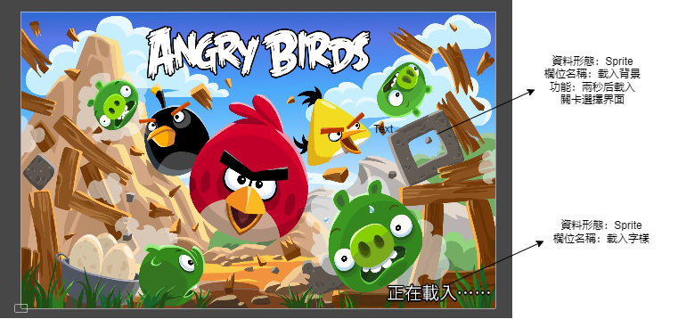
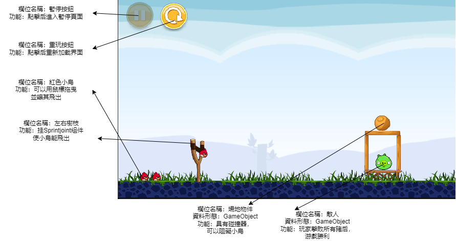
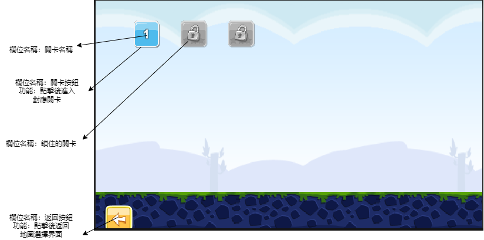
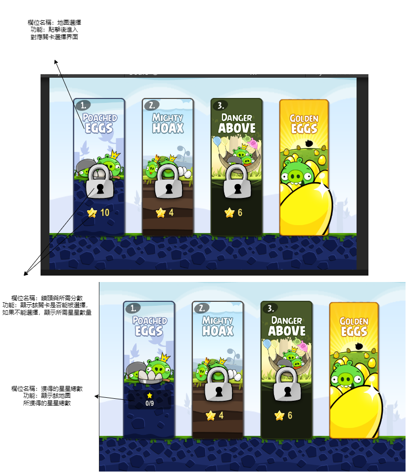
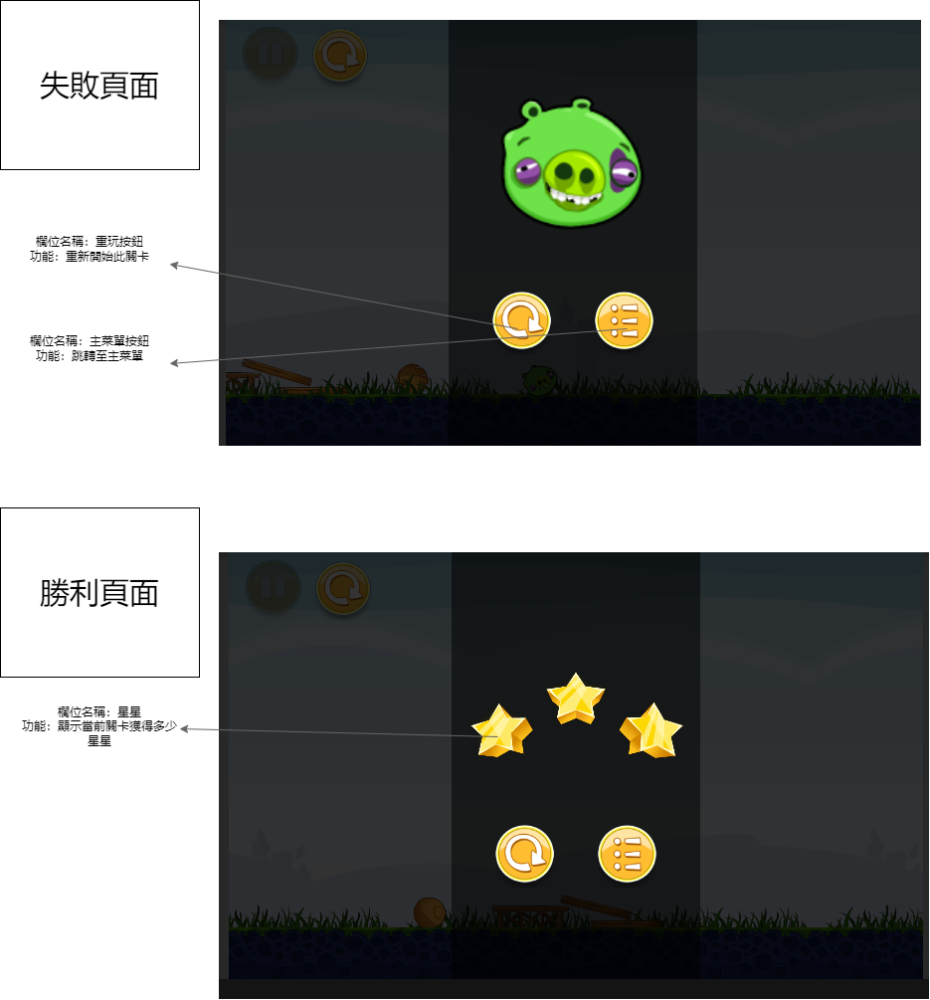
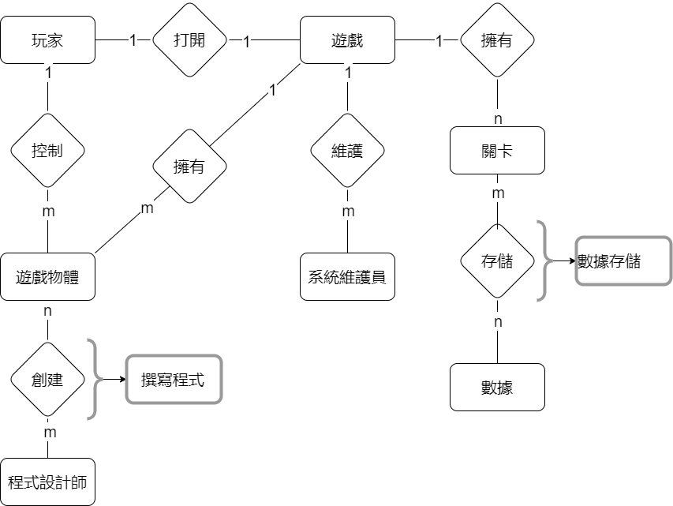

## 繪出UML 類別圖(class Diagram)

## 繪製循序圖與活動圖
 ### UseCase1:
1. 循序圖

2. 活動圖

---
 ### UseCase2:
1. 循序圖

2. 活動圖

---

 ### UseCase3:
1. 循序圖

2. 活動圖

---
##  HW5:請透過分鏡板(storyboard)的形式向使用者展示初始的螢幕設計

---
## HW6 : 請劃出實體關係圖(entity-relationship diagram, ERD)向使用者展示內部的資料庫設計:

