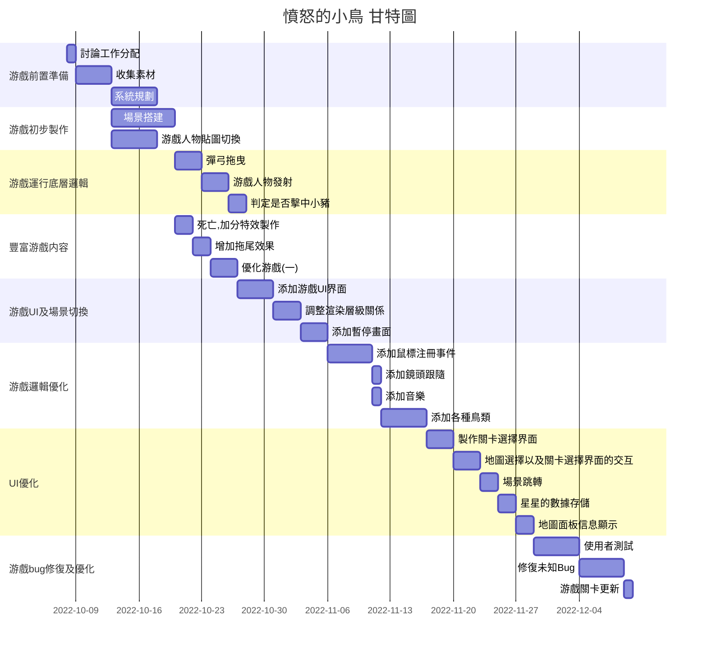

# Group01 - MY's Team
## Team Leader - 龔玖恩
### Member：
- 李佳燕
- 張理畯
- 羅義康

```mermaid
gantt
    title 憤怒的小鳥 甘特圖
    dateFormat  YYYY-MM-DD
    section 游戲前置準備
    討論工作分配           :a1, 2022-10-08, 1d
    收集素材     :a2, after a1  , 4d
    系統規劃     :a3, after a2  , 5d
    section 游戲初步製作
    場景搭建      :a4, after a2  , 7d
    游戲人物貼圖切換      :a5, after a2  , 5d
    section 游戲運行底層邏輯
    彈弓拖曳      :a6, after a4  , 3d
    游戲人物發射      :a7, after a6  , 3d
    判定是否擊中小豬      :a8, after a7, 2d
    section 豐富游戲内容
    死亡,加分特效製作     :a9, after a4, 2d
    增加拖尾效果      :a10, after a9, 2d
    優化游戲(一)     :a11, after a10, 3d
    section 游戲UI及場景切換
    添加游戲UI界面      :a12, after a11, 4d
    調整渲染層級關係      :a13, after a12, 3d
    添加暫停畫面      :a14, after a13, 3d
    section 游戲邏輯優化
    添加鼠標注冊事件      :a15, after a14, 5d
    添加鏡頭跟隨      :a16, after a15, 1d
    添加音樂      :a17, after a15, 1d
    添加各種鳥類      :a18, after a17, 5d
    section UI優化
    製作關卡選擇界面      :a19, after a18, 3d
    地圖選擇以及關卡選擇界面的交互     :a20, after a19, 3d
    場景跳轉       :a21, after a20, 2d
    星星的數據存儲     :a22, after a21, 2d
    地圖面板信息顯示      :a23, after a22, 2d
    section 游戲bug修復及優化
    使用者測試     :a24, after a23, 5d
    修復未知Bug     :a25, after a24, 5d
    游戲關卡更新      :a26, after a25,1d
```
