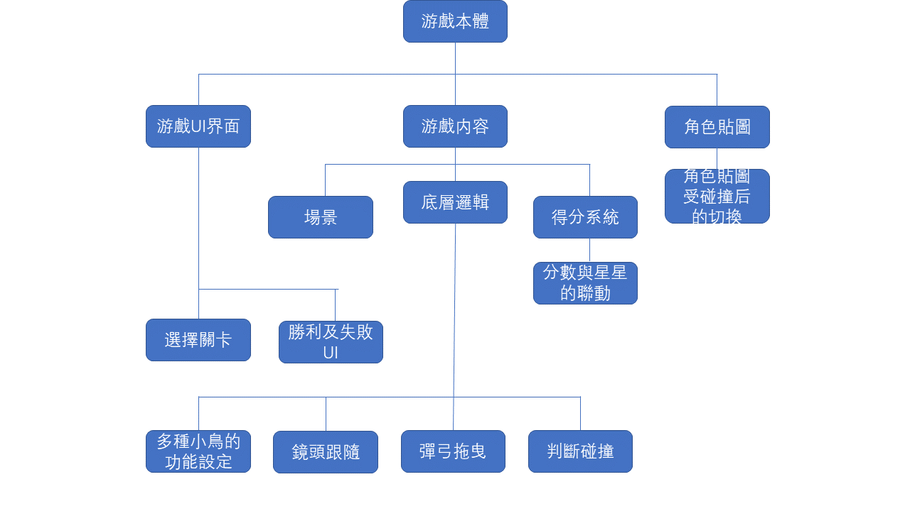

### 游戲功能性需求與非功能性需求
#### 
- 功能性需求
1.
2.
3.

#### 
- 非功能性需求
1.
2.
3.

---
### 功能分解圖-Functional Decomposition Diagram

## [Figma_Prototype](https://www.figma.com/proto/MvdXjIDhOMf1wYrrSlkXxd/Untitled?node-id=2%3A2&scaling=min-zoom&page-id=0%3A1&starting-point-node-id=2%3A2&show-proto-sidebar=1)

### 需求分析的文字描述
1.

2.

3.

----
### 使用案例圖 
案例（一）
|使用者案例名稱|説明|
|:---:|:---:|
|     |     |
|     |     |
|     |     |

