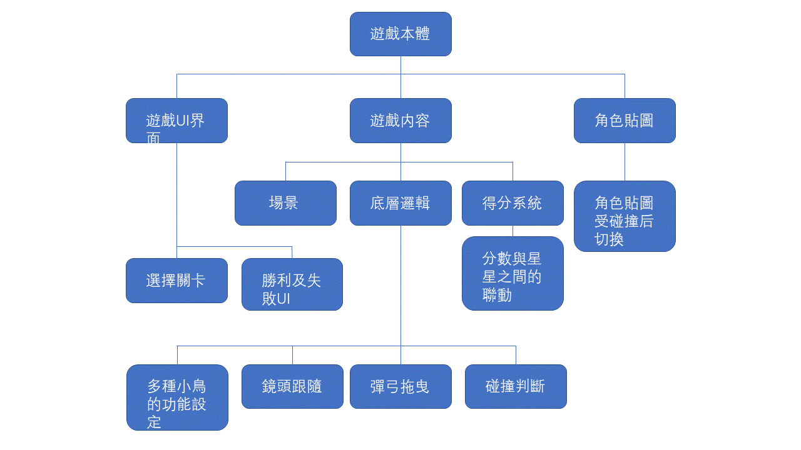

## 游戲功能性需求與非功能性需求
#### 
- 功能性需求

1.拖拽彈弓: 發射 憤怒鳥攻擊敵人 獲得分數

2.進度保存: 暫停應用與保存進度

3.關卡選擇: 可自由選擇已通過的關卡

####
- 非功能性需求

1.使用性: 第一次使用即可上手

2.效能: 包含的物理效果及遊戲貼圖較少，運行效能高

3.可靠度: 屬於本地遊戲，系統崩潰率低

---
## 功能分解圖-Functional Decomposition Diagram

## [Figma_Prototype](https://www.figma.com/proto/MvdXjIDhOMf1wYrrSlkXxd/Untitled?node-id=2%3A2&scaling=min-zoom&page-id=0%3A1&starting-point-node-id=2%3A2&show-proto-sidebar=1)

## 需求分析的文字描述
1. 玩家可點擊開始遊戲來遊玩
2. 遊戲開發人員可改變關卡設置
3. 玩家可透過控制滑鼠來遊玩關卡
4. 玩家可點擊設置來改變操作 

---

## 使用案例圖
### 案例（一）

|使用者案例名稱|關卡選擇|
|:-----:|:---------|
|行動者|玩家|
|説明|玩家可以任意選擇已通關之關卡|
|完成動作|1.選擇世界   2.選擇世界中的小關卡   3.開始游戲
|替代方法|無    |
|先決條件|1.要選擇的關卡必須先通關 2.要選擇的世界必須先通關 3.需要按下開始按鈕|
|後置條件|在選擇的關卡中游玩|
|假設|無|

### 案例（二）

|使用者案例名稱|遊戲暫停|
|:-----:|:---------|
|行動者|玩家|
|説明|暫停進行中的遊戲|
|完成動作|遊玩遊戲時點擊左上角的暫停鍵|
|替代方法|遊玩遊戲時不觸碰任何鍵位|
|先決條件|遊戲進行中|
|後置條件|遊戲被暫停|
|假設|無|

### 案例（三）

|使用者案例名稱|退出遊戲|
|:-----:|:---------|
|行動者|玩家|
|説明|將在進行中的遊戲返回到選擇關卡的界面|
|完成動作|1.點擊遊戲左上角的暫停鍵 2.點擊暫停頁面中的Menu鍵    |
|替代方法|1.從後臺關閉遊戯 2.從任務欄中關閉遊戲|
|先決條件|遊戲進行中|
|後置條件|遊戲被推出/返回選擇關卡的界面|
|假設|游戲沒被正確退出，可能導致進度沒被保存      |
